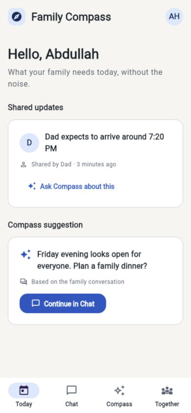

# Family Compass

Family Compass helps families spend more time together and reduce everyday uncertainty through information each person chooses to share.

The product has two outcomes, in this order:

1. Help families gather more often.
2. Provide reassurance without turning the app into a family tracker.



## Current status

Prototype 2 is the current experience prototype. It is a working Flutter application with deterministic local scenarios. It does not use real GPS, SMS, push notifications, a production database, or a live AI provider.

The repository also preserves Prototype 1 as a frozen learning artifact. The two prototypes have separate source directories, Flutter versions, commits, and Git tags.

## Versions

| Stage | Status | Purpose | Source | Git ref |
|---|---|---|---|---|
| Prototype 1 | Frozen | Broad five-tab exploration of the original idea | [`prototypes/prototype-1`](prototypes/prototype-1) | `prototype-1-v0.1.0` |
| Prototype 2 | Current | Validate gathering, reassurance, privacy, and adaptive mobile structure | [`prototypes/prototype-2`](prototypes/prototype-2) | `prototype-2-v0.2.0` |
| Prototype 3 | Planned | Functional multi-device family pilot | [`TODO.md`](TODO.md#prototype-3-functional-multi-device-pilot) | Not released |
| Version 1 | Planned | Production consent-first core product | [`TODO.md`](TODO.md#version-1-production-release) | Not released |
| Version 2 | Planned | Better repeated gathering, then separately approved context experiments | [`TODO.md`](TODO.md#version-2a-easier-gathering) | Not released |

## Try Prototype 2

Install Flutter stable, then run:

```bash
cd prototypes/prototype-2
flutter pub get
flutter test
flutter run
```

For a quick browser preview:

```bash
flutter run -d chrome
```

The iOS and Android runner folders are included. Native launch requires the matching Xcode or Android SDK tools on the development computer.

Long press the Family Compass wordmark to switch among the prepared demo scenarios.

## Prototype 2 demonstration flow

1. Open Chat and turn Mom's Friday dinner message into a plan.
2. Review the family-visible Compass draft.
3. Send a poll for 7:00 PM and 7:30 PM.
4. Respond, send the one allowed nudge, and confirm 7:30 PM.
5. Review the automatic gathering reminder and volunteer to bring dessert.
6. Open private Compass and ask where Dad is.
7. Inspect the manual source, freshness, and Why this answer explanation.
8. Switch to the unknown scenario and verify that Compass does not imply hidden information exists.

## Try Prototype 1

Prototype 1 has a Web runner and remains available for comparison:

```bash
cd prototypes/prototype-1
flutter pub get
flutter test
flutter run -d chrome
```

Prototype 1 includes the earlier visible Journey concept, five-tab navigation, dashboard roster, AI screen, and reminders. Those choices were intentionally replaced in Prototype 2.

## Product boundaries

Family Compass is not intended to become:

- A permanent family map
- A hidden background tracking system
- An AI that impersonates or answers for a family member
- A leaderboard measuring who cares more
- A replacement for a full general-purpose messaging platform

Every adult controls their own sharing. Permission checks must happen before permitted structured facts reach an AI provider.

## Repository structure

```text
SMAC2026/
├── README.md
├── TODO.md
├── docs/
│   ├── PRODUCT_ROADMAP.md
│   ├── PROTOTYPE_2_BUILD_PLAN.md
│   └── assets/
├── prototypes/
│   ├── prototype-1/
│   └── prototype-2/
└── family_compass_backend/
```

The earlier unrelated website experiment is not included as a mobile prototype.

## Documentation

- [`TODO.md`](TODO.md) is the current actionable plan.
- [`docs/PRODUCT_ROADMAP.md`](docs/PRODUCT_ROADMAP.md) is the approved full product roadmap.
- [`docs/PROTOTYPE_2_BUILD_PLAN.md`](docs/PROTOTYPE_2_BUILD_PLAN.md) is the approved historical build plan used for Prototype 2.

The build plan records the state before implementation began. Use `TODO.md` for current completion status and next work.

## Backend status

[`family_compass_backend`](family_compass_backend) is the provider-neutral FastAPI scaffold reserved for Prototype 3. It uses in-memory data today and is not connected to Prototype 2.

```bash
cd family_compass_backend
python3 -m venv .venv
source .venv/bin/activate
pip install -r requirements-dev.txt
uvicorn app.main:app --reload
```

The backend boundary can later connect to Firebase, a real database, notifications, and OpenAI, LM Studio, vLLM, or another compatible AI provider.

## Validation status

Prototype 1:

- Flutter analysis passes
- One historical dashboard widget test passes

Prototype 2:

- Flutter analysis passes with no issues
- Nine interaction and adaptive-layout widget tests pass
- Flutter Web release build succeeds
- Portrait, compact landscape, medium width, light, dark, and Arabic right-to-left layouts were visually checked
- Native iOS, Android, and physical-device smoke tests remain open

## Versioning policy

- Prototype 1 uses Flutter `0.1.0+1` and tag `prototype-1-v0.1.0`.
- Prototype 2 uses Flutter `0.2.0+2` and tag `prototype-2-v0.2.0`.
- Prototype tags are annotated snapshots and must not be moved.
- Future prototypes receive their own semantic pre-release version, release notes, and immutable tag.
- Production Version 1 starts at `1.0.0` only after the production exit gate is met.
