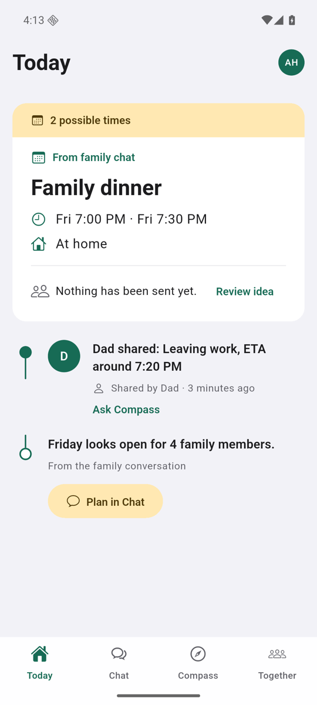

# Family Compass

Family Compass helps families make time together and reduce everyday uncertainty through information each person chooses to share.

The product has two outcomes, in this order:

1. Help families gather more often.
2. Provide reassurance without turning the app into a family tracker.

## Current build

The active source is the Version 1 foundation at [`apps/family_compass`](apps/family_compass). It is a working Flutter app with the warm Sunday Table visual system, a complete gathering flow, adaptive phone and tablet layouts, English and Arabic, light and dark themes, explicit sharing controls, and an optional real FastAPI data mode.

The FastAPI service at [`family_compass_backend`](family_compass_backend) is the local Prototype 3 pilot backend. It uses persistent SQLite by default, also supports PostgreSQL, verifies signed development or Firebase ID tokens, and implements family-scoped invitations, chat, plans, reminders, check-ins, temporary voluntary statuses, WebSocket events, exact notification links, and provider-neutral AI. The app can still run in a deterministic offline demonstration mode.



The launcher icon source is [`apps/family_compass/assets/brand/family-compass-icon-master.png`](apps/family_compass/assets/brand/family-compass-icon-master.png). Its iOS, Android, Web, maskable Web, and favicon exports replaced the default Flutter placeholders.

Android and iOS now use the foundation namespace `com.smac.familycompass` instead of Flutter's placeholder IDs. Android upload signing is configured and verified locally. An Apple Development identity and free Personal Team provisioning profile now sign the local iPhone Profile build. Production Apple signing, Play App Signing, and store verification remain open.

This build is `0.3.0-dev.1+3`. It is not a production `1.0.0` release. The development Firebase project has registered iOS and Android apps, Phone sign-in enabled, a UAE-only SMS region allowlist, and two UAE-format fictional test accounts whose codes remain only in macOS Login Keychain. Both accounts completed real Firebase cloud phone authentication and `accounts:lookup` without sending SMS. Runtime family binding and notification flows are wired in the app. Production backend Application Default Credentials and cloud invitation testing, paid Apple enrollment and APNs production delivery, FCM delivery, Play App Signing, physical Android and real-family testing, store verification, independent security review, and the pilot exit gate remain open.

## Versions

| Stage | Status | Purpose | Source or plan |
|---|---|---|---|
| Prototype 1 | Frozen | Broad five-tab exploration | [`prototypes/prototype-1`](prototypes/prototype-1), tag `prototype-1-v0.1.0` |
| Prototype 2 | Frozen | Validate gathering, reassurance, privacy, and four-tab structure | [`prototypes/prototype-2`](prototypes/prototype-2), tag `prototype-2-v0.2.0` |
| Version 1 foundation | Active | Establish the production direction and safe service boundaries | [`apps/family_compass`](apps/family_compass) |
| Prototype 3 local pilot foundation | Active | Connect persistent family accounts, live data, and notifications across test devices | [`TODO.md`](TODO.md#prototype-3-functional-multi-device-pilot) |
| Version 1 release | Gated | Production consent-first core product | [`TODO.md`](TODO.md#version-1-production-release) |
| Version 2 | Planned | Improve repeated gathering, then test separately consented context | [`TODO.md`](TODO.md#version-2a-easier-gathering) |

[`VERSIONS.md`](VERSIONS.md) is the canonical version index and explains which directories are frozen versus active.

## Run the active Flutter app

Install Flutter stable, then run:

```bash
cd apps/family_compass
flutter pub get
flutter analyze
flutter test
flutter run
```

For a convenient desktop preview:

```bash
flutter run -d chrome
```

The browser target is for preview and testing. The product interface is designed as an adaptive mobile app, and iOS and Android runner projects are included.

Without the backend flag, long press the current page title to switch among the prepared dinner, poll, reassurance, unknown, empty, offline, AI-unavailable, sharing-paused, and notification-denied scenarios.

## Demonstration flow

1. Start on Today and see the Friday dinner as the main family thread.
2. Open Chat and turn Mom's dinner message into a plan.
3. Review the Compass draft, send a poll, reply, send the one allowed nudge, and confirm the plan.
4. Open Together to review the reminder and add a voluntary contribution.
5. Open private Compass and ask where Dad is.
6. Inspect the member-provided source and freshness, then switch to the unknown scenario and confirm that Compass does not imply hidden information exists.
7. Open the family menu, review My Sharing, and pause the current manual update.

## Run the backend

```bash
cd family_compass_backend
python3 -m venv .venv
source .venv/bin/activate
pip install -r requirements-dev.txt
pytest -q
python3 -m compileall -q app tests
export FAMILY_COMPASS_AUTH_MODE=dev
export FAMILY_COMPASS_DEV_AUTH_SECRET="$(python -c 'import secrets; print(secrets.token_urlsafe(32))')"
uvicorn app.main:app --reload
```

Open `http://127.0.0.1:8000/docs` for the interactive API. In another backend terminal, generate a one-hour token for the seeded Abdullah account:

```bash
source .venv/bin/activate
python -m app.dev_token 11111111-1111-1111-1111-111111111111
```

The token is sent as `Authorization: Bearer <token>`. Protected routes fail closed when authentication is not configured. [`family_compass_backend/README.md`](family_compass_backend/README.md) also contains the verified Firebase Auth emulator flow.

The backend currently demonstrates:

- Persistent family-scoped membership and permission checks
- Create, accept, decline, revoke, and expire invitation flows, including an explicit multi-invitation chooser with masked phone responses
- Idempotent family messages, offline mobile writes, and authenticated family events
- Plans, polls, replies, contributions, nudges, completion, and standalone or plan-linked reminders
- Explicit updates, status summaries, and member-written journey summaries with audience and expiry
- Device registration and authenticated links that fetch and reveal the exact message, plan, poll, or reminder
- Today and private Compass data assembled after authorization and provider consent
- A provider boundary for OpenAI, LM Studio, vLLM, or another OpenAI-compatible provider

It does not expose coordinates, routes, battery state, location history, or a global user directory. A “journey” in the API is a short member-written and expiring summary, never a location stream.

## Product boundaries

Family Compass is not intended to become:

- A permanent family map or hidden background tracking system
- An AI that impersonates or answers for a family member
- A leaderboard, care score, or pressure system
- A replacement for a full general-purpose messaging platform

Every adult controls their own sharing. Permission, audience, expiry, and provider consent checks happen before structured family facts reach an AI provider.

## Repository structure

```text
SMAC2026/
├── apps/family_compass/       # Active Flutter foundation
├── family_compass_backend/    # Persistent FastAPI pilot backend
├── prototypes/prototype-1/    # Frozen
├── prototypes/prototype-2/    # Frozen
├── docs/                      # Roadmap, plans, and research artifacts
├── PRODUCT.md                 # Product contract
├── DESIGN.md                  # Visual and interaction contract
├── TODO.md                    # Current work and release gates
└── README.md
```

## Documentation

- [`PRODUCT.md`](PRODUCT.md) defines the current product promise and permanent boundaries.
- [`DESIGN.md`](DESIGN.md) defines the native Sunday Table design system.
- [`VERSIONS.md`](VERSIONS.md) records every prototype, active compatibility line, and release rule.
- [`CHANGELOG.md`](CHANGELOG.md) summarizes the tagged prototypes and current unreleased foundation.
- [`TODO.md`](TODO.md) tracks current completion and release gates.
- [`docs/PRODUCT_ROADMAP.md`](docs/PRODUCT_ROADMAP.md) contains the approved staged product roadmap.
- [`docs/PROTOTYPE_2_BUILD_PLAN.md`](docs/PROTOTYPE_2_BUILD_PLAN.md) preserves the historical Prototype 2 build plan.
- [`docs/SECURITY_PRIVACY_MODEL.md`](docs/SECURITY_PRIVACY_MODEL.md) records the implemented local authorization, consent, deletion, and AI boundaries.
- [`docs/PROTOTYPE_3_VALIDATION_CHECKLIST.md`](docs/PROTOTYPE_3_VALIDATION_CHECKLIST.md) contains the physical-device and three-family pilot gate.

## Verified so far

- Active Flutter analysis passes with no issues.
- All 193 Flutter tests pass. The suite covers real repository contracts, authenticated event reconnect, exact and foreground notification routing, bounded APNs readiness, native Firebase configuration selection, gathering states and live plan actions, private and family-room Compass, stable family-member IDs and accessible `@Compass` mentions, explicit invitation choice, selected-recipient sharing, offline restart recovery, onboarding and Together system Back behavior, adaptive layouts and safe areas, Arabic RTL, maximum iOS Dynamic Type navigation, 200 percent content text, contrast, and semantics.
- The Flutter Web release build succeeds.
- All 122 FastAPI tests pass. Python compilation and lint pass, installed requirements are consistent, and the current dependency audit reports no known vulnerabilities. The suite includes persistent storage, concurrent writes, cross-family isolation, invitation-event audience restrictions, expiry, redaction, structured member mentions, shared authorized Chat context, durable question-first Compass replies, private and family-room AI isolation, AI minimization, notification boundaries, Firebase account linking, immediate access loss after family deletion, and provider failures.
- Firebase-enabled Android and iOS Simulator candidates initialize and open at onboarding. The Android candidate was tested on an emulator, and the iOS candidate launched on an iPhone 17 simulator.
- Firebase SMS regions are restricted to the UAE. Two UAE-format fictional test accounts completed real Firebase cloud phone authentication and `accounts:lookup` without sending SMS; their verification codes remain only in macOS Login Keychain.
- The Android debug and upload SHA-1 and SHA-256 fingerprints are registered with Firebase. A protected upload key is stored outside the repository with its passwords in macOS Login Keychain, and the signed Firebase-enabled release AAB passed signature verification.
- An Apple Development identity and free Personal Team provisioning profile were created. The signed Profile app was installed and launched successfully on the connected physical iPhone after its Developer App profile was trusted. The fictional no-SMS account completed registration, family creation, authenticated events, and initial family-data loading. The app can open directly from the Home Screen without Flutter tooling.
- Firebase Phone Authentication now preserves safe provider reference codes and prevents repeated requests for 15 minutes after a `too-many-requests` response. The project remains on Spark, so real verification SMS is pending explicit approval to enable Blaze billing; fictional UAE test accounts remain available without SMS.
- The native Sunday Table redesign is covered by visual, adaptive, RTL, large-text, and accessibility contract checks.

Production Apple signing and profiles, Play App Signing, store verification, physical-device assistive-technology checks, real notification delivery, real-family usability, independent security review, and production reliability testing remain open. The physical iPhone has Developer Mode enabled, is paired and unlocked with its Developer Disk Image available, and appears in Xcode. Its signed Firebase-enabled Profile app is installed and its first physical launch is verified. The free Personal Team profile expires after 7 days and must be renewed and the app reinstalled for continued local testing. This build omits the `aps-environment` entitlement, so real APNs remains pending paid Apple Developer enrollment. No physical Android phone is available for this run. Follow [`docs/IOS_TESTING.md`](docs/IOS_TESTING.md), [`docs/ANDROID_TESTING.md`](docs/ANDROID_TESTING.md), and the external validation checklist for the remaining device matrix.

## Versioning policy

- Prototype 1 is `0.1.0+1` at immutable tag `prototype-1-v0.1.0`.
- Prototype 2 is `0.2.0+2` at immutable tag `prototype-2-v0.2.0`.
- The active foundation is `0.3.0-dev.1+3` and has no release tag.
- Production Version 1 starts at `1.0.0` only after the release gate in the roadmap is met.
